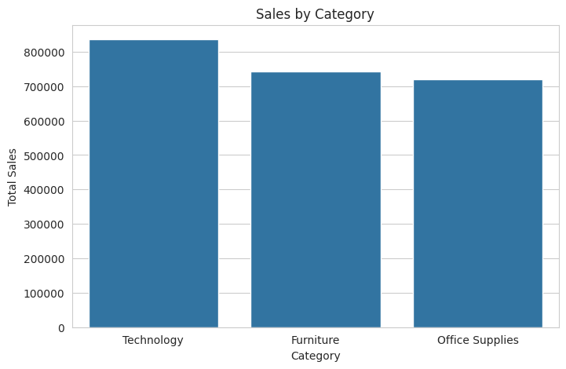
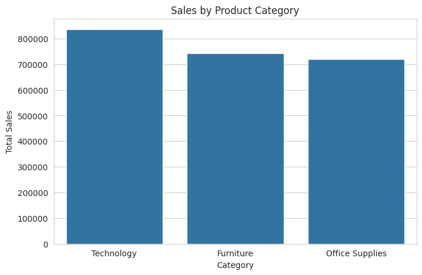
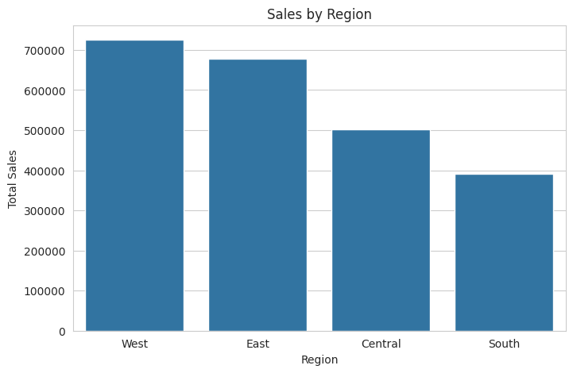

# 📊 Sales Performance Analysis

This project performs an Exploratory Data Analysis (EDA) on a retail sales dataset to identify revenue patterns, product performance, profitability trends, and customer segment contributions.

The objective is to transform raw sales data into actionable business insights that support data-driven decision making for commercial strategy and business operations.

This repository is part of a Data Analytics portfolio demonstrating skills in data cleaning, exploratory analysis, and data visualization using Python.

---

# 🎯 Project Objectives

The main objectives of this analysis are:

- Understand overall sales performance
- Identify top-performing product categories
- Analyze profitability across categories
- Evaluate regional sales performance
- Identify top-selling products
- Explore sales patterns over time
- Generate business insights and recommendations

---

# 🗂️ Dataset

The dataset used in this project is a retail sales dataset commonly used for business analytics and business intelligence practice.

It includes information such as:

- Order Date
- Product Category
- Product Name
- Sales
- Profit
- Customer Segment
- Region
- Quantity
- Discount

This dataset allows the exploration of revenue drivers, profitability patterns, and customer behavior.

---

# 🧰 Technologies Used

- 🐍 Python
- 📊 Pandas
- 🔢 NumPy
- 📈 Matplotlib
- 🎨 Seaborn
- ☁️ Google Colab
- 🗂️ GitHub

---

# 📈 Analysis Performed

The analysis follows a structured workflow.

## Data Preparation

- Data loading
- Data structure inspection
- Date formatting
- Missing value verification

## Exploratory Analysis

- Overall sales and profit overview
- Sales distribution by category
- Sales performance by region
- Customer segment contribution
- Top-selling products analysis
- Profitability analysis
- Monthly sales trend exploration

## Statistical Exploration

- Sales vs Profit relationship
- Correlation analysis between key variables

---

# 📊 Key Visualizations

The project includes several visualizations to better understand business performance.

- Sales by Category
- Sales by Region
- Top 10 Products by Revenue
- Profit by Category
- Monthly Sales Trend
- Sales vs Profit Scatter Plot
- Correlation Heatmap

These visualizations help reveal patterns, performance drivers, and potential inefficiencies in the business.

---

# 📌 Key Business Insights

Several important insights were identified during the analysis.

- The Technology category generates the highest total revenue and represents the main revenue driver for the business.
- Furniture generates high sales volume but significantly lower profit, suggesting potential margin challenges.
- The Consumer segment contributes the largest share of total sales, indicating that individual customers are the core market.
- A small number of high-value products generate a large portion of the total revenue, showing strong product concentration.
- Profit values show high variability, including negative profits, indicating that discount strategies may sometimes reduce profitability.

---

# 💡 Business Recommendations

Based on the findings, several strategic recommendations can be proposed.

- Focus growth strategies on high-performing categories such as Technology.
- Review pricing and discount strategies in lower-margin categories like Furniture.
- Strengthen marketing efforts targeting the Consumer segment, which represents the largest revenue source.
- Promote top-performing products through bundles, upselling, or premium services.
- Monitor discount levels carefully and implement profitability tracking to avoid negative margins.

---

# 📁 Project Structure
```
    05-sales-performance-analysis
    │
    ├── data
    │   └── superstore.csv
    │
    ├── notebooks
    │   └── sales_performance_analysis.ipynb
    │
    ├── images
    │   ├── sales_by_category.png
    │   ├── profit_by_category.png
    │   ├── sales_by_region.png
    │   └── top_products.png
    │
    ├── README.md
    │
    └── requirements.txt
```
---

# 📊 Sample Visualizations

## Sales by Category


## Profit by Category


## Sales by Region


---

# 📓 Analysis Notebook

The full analysis can be found in the notebook located in the notebooks folder.

The notebook includes:

- Data cleaning
- Exploratory data analysis
- Data visualization
- Business insights generation

---

# 🚀 Future Improvements

Possible extensions of this project include:

- Building an interactive dashboard using Power BI
- Developing sales forecasting models
- Performing customer segmentation analysis
- Incorporating larger real-world datasets

---

## ▶️ Run the Notebook

- Open in Google Colab  
- Upload CSV dataset  
- Execute cells step by step  

---


## 👤 Author

Pedro Tamani  
Economist | Business Analysis | Decision Support  

📍 Based in Lima, Peru  

🔗 LinkedIn: 

[](https://linkedin.com/in/pedrotamani)

📧 Email  
pedro.tamani@gmail.com

